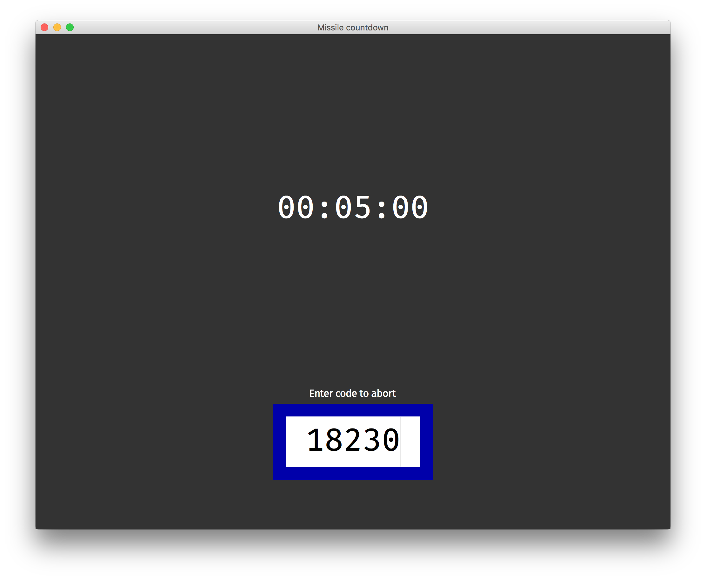

# Escape room simple clock
[](https://travis-ci.org/Lakitna/Escape-room-simple-clock)
[](https://coveralls.io/github/Lakitna/Escape-room-simple-clock?branch=master)

A minimal Python based system to provide a countdown and code input for very simple escape rooms.

[Screenshot 2](documentation/screenshot_wrong.png) 

[Screenshot 3](documentation/screenshot_success.png) 


# Table of Contents

- [Recommended hardware](#recommended-hardware)
- [Getting it to work](#getting-it-to-work)
  - [Troubleshooting](#troubleshooting)
  - [About fonts](#about-fonts)
- [Changing the settings](#changing-the-settings)
  - [Some notes](#some-notes)


## Recommended hardware

There's not a lot you need to make this work in an escape room setting:

* A computer with Python 3, like a Raspberry Pi, Windows pc or a Mac.  
  [How do I install Python?](http://docs.python-guide.org/en/latest/starting/installation/)
* A (wireless) numpad. While this program does support alphanumeric codes using a full keyboard, it was build to be used with only a numpad.  
  [Example](https://i.ebayimg.com/images/g/KRoAAOSwVDZaDLS1/s-l300.jpg)
* A screen
* Some speakers


## Getting it to work

1. Install the latest version of Python 3.  
   [How do I install Python?](http://docs.python-guide.org/en/latest/starting/installation/)

2. Download all files from this repository.

3. Open a `terminal` window. On Windows open a `cmd` window.

4. Navigate to the folder containing the downloaded files using the `cd` command.   
   [What is cd?](https://en.wikipedia.org/wiki/Cd_(command)?)

5. Install the requirements by running the following command:

   ```bash
   pip3 install -r requirements.txt
   ```

6. To start the program run the following command:

   ```bash
   python3 src
   ```


#### Troubleshooting

* If you get an error stating that Tkinter can not be imported, please consult the [Tkinter installation guide](https://tkdocs.com/tutorial/install.html).
* If you get a Python error please make sure your command starts with `python3` and __not__ `python`. The latter uses Python 2 and is incompatible.
* If you get an error stating `ModuleNotFoundError` please run step 5 again. Make sure that the command stats with `pip3` and __not__ `pip`. The latter uses Python 2 and is incompatible.
* For any other errors feel free to open an issue.

#### About fonts

By default the following open source fonts are used:

- [Fira Mono](https://fonts.google.com/specimen/Fira+Mono) for numbers
- [Fira Sans](https://fonts.google.com/specimen/Fira+Sans) for text

If you don't want to, or can't, download these fonts you can [change the settings](#changing-the-settings) to use some other font.


## Changing the settings

I'm assuming that at this stage you've got the program running as explained in [Getting it to work](#getting-it-to-work).

Open the settings file in `src/settings.py` in any plain text editor like [one mentioned here](https://lifehacker.com/five-best-text-editors-1564907215). On Windows you can simply use Notepad.

The settings are in a Python file and thus require Python syntax, so don't remove any `"`, `'`, `{`, `}`,`[`,`]`,`(`,`)`,`=` or `:` characters. If you make any errors here you will be told via the terminal when you try to run the program.

Let's take a look at a part of the settings file:

```python
countdown_time = 5 * 60  # Time on the clock in seconds
code_linger_time = 300  # Time code stays on screen after end in seconds
correct_code = "80085"  # The correct code
tries = 3  # Amount of code input attempts allowed
color_change_on = 5 * 60  # Time in seconds where to start changing the screen color
```

#### Some notes

* You can do math in the numeric settings. Note on the first and last lines where it states `5 * 60` seconds, or 5 minutes.
* Everything after a `#` character is explanatory text for the value that comes before.
* If you break the settings somehow the worst thing that can happen is that the program exits.
* When changing a text please note that a line-break has to be explicitly specified by typing `\n`.
* All colors are in hexadecimal notation. For example: `#FF0000` equals to red.  
  [Learn more about hexadecimal colors](https://htmlcolorcodes.com/).
* The futher down you scroll the more advanced the settings get. If you don't understand a bit just try things out, there really aren't any bad things that can happen.
* If you want to edit or remove sounds simply search (`ctrl` + `f`) for `sound.queue`. Most sounds are defined in `__main__.py`.
* All sound files are located in `src/sound`. To use a new sound simply drag it into that folder. Only `.wav` files are supported.